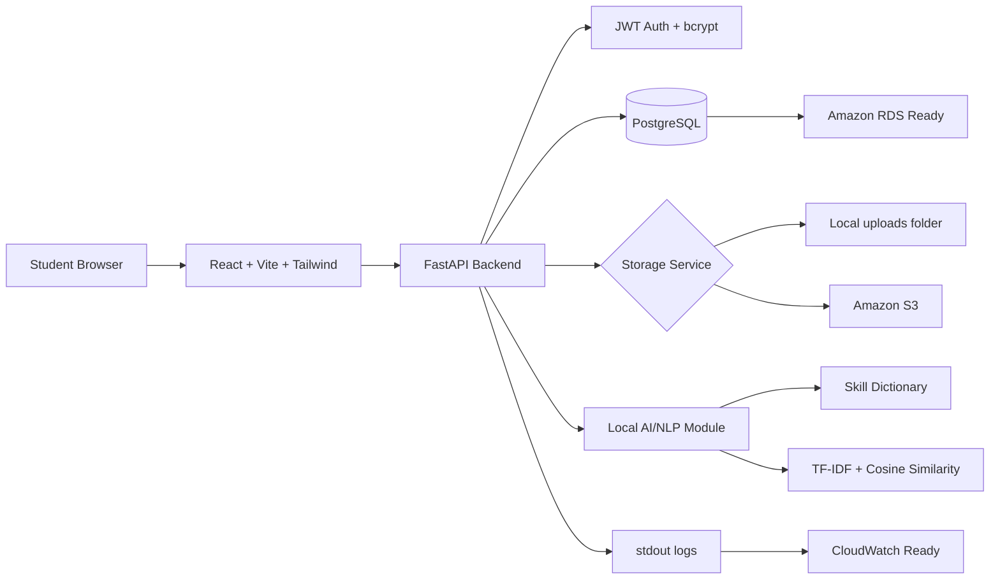

# AI-Powered Internship Application Tracker on AWS

A full-stack MVP for students to manage internship applications, upload supporting documents, and compare a CV against a job description with a local AI/NLP scoring module. The app runs locally with Docker Compose and is structured so storage, database, logging, and deployment settings can move to AWS through environment variables.

## Features

- JWT authentication with registration, login, and current user profile.
- User-isolated internship application CRUD.
- Document uploads for CV, transcript, certificate, and other files.
- Local development file storage with a switchable S3 storage service.
- Role-based candidate and HR accounts.
- Candidate profile, job board browsing, and job application submission with existing uploaded documents.
- HR company profile management, job posting CRUD, applicant review, and status updates.
- Status timeline for HR-driven candidate job application changes.
- Local AI/NLP CV-job matching with skill extraction, TF-IDF cosine similarity, suggestions, cover letter draft, and interview questions.
- Dashboard statistics for applications, statuses, documents, average AI score, and recent activity.
- Dockerfiles for frontend and backend plus Docker Compose for FastAPI and Vite.
- Alembic migration, seed script, and backend tests.

## Architecture



## Tech Stack

- Frontend: React, Vite, Tailwind CSS, Axios, React Router, lucide-react
- Backend: FastAPI, SQLAlchemy, Alembic, Pydantic
- Database: PostgreSQL
- Auth: JWT with python-jose, passlib, bcrypt
- Storage: local files in development, S3-compatible storage with boto3 in production
- AI/NLP: skill dictionary, scikit-learn TF-IDF, cosine similarity
- Deployment: Docker, Docker Compose, AWS-ready environment variables

## Project Structure

```text
backend/
  app/
    main.py
    core/
    db/
    routers/
    services/
    seed.py
  alembic/
  tests/
  requirements.txt
  Dockerfile
frontend/
  src/
    api/
    components/
    context/
    pages/
    routes/
  package.json
  Dockerfile
docker-compose.yml
.env.example
README.md
```

## Run The Full Project From The Root

Run the commands in this section from the repository root, where `docker-compose.yml` is located.

1. Copy the environment file if `.env` does not exist:

```bash
cp .env.example .env
```

PowerShell equivalent:

```powershell
Copy-Item .env.example .env
```

2. Edit `.env` and configure `DATABASE_URL`, `SECRET_KEY`, storage, CORS, and the frontend API URL. For a local browser with the backend exposed on the same machine:

```env
BACKEND_PORT=8001
VITE_API_BASE_URL=http://localhost:8001
BACKEND_CORS_ORIGINS=http://localhost:5173,http://127.0.0.1:5173
```

For the full stack running on the current EC2 public IP:

```env
BACKEND_PORT=8001
VITE_API_BASE_URL=http://<EC2_PUBLIC_IP>:8001
BACKEND_CORS_ORIGINS=http://<EC2_PUBLIC_IP>:5173
```

3. Build and start the full stack in the background:

One-command startup on EC2/Linux also waits for both services and loads the idempotent demo seed:

```bash
bash scripts/start.sh
```

PowerShell equivalent:

```powershell
powershell -ExecutionPolicy Bypass -File scripts/start.ps1
```

The underlying manual startup command is:

```bash
docker compose up -d --build
```

The backend automatically runs `alembic upgrade head` before Uvicorn starts.

4. Check container state and startup logs:

```bash
docker compose ps
docker compose logs --tail=100 backend
docker compose logs --tail=100 frontend
```

5. Verify the services:

```bash
curl --fail http://127.0.0.1:8001/health
curl --fail http://127.0.0.1:5173
```

Open the app locally:

```text
Frontend: http://localhost:5173
Backend API docs: http://localhost:8001/docs
Health check: http://localhost:8001/health
```

For EC2, replace `localhost` with the EC2 public IP. Its security group must allow `5173` and `8001` only from the administrator's public IP while testing.

Follow logs continuously:

```bash
docker compose logs -f
```

Apply migrations manually when needed:

```bash
docker compose run --rm backend alembic upgrade head
docker compose run --rm backend alembic current
```

Run backend tests and the frontend production build:

```bash
docker compose run --rm backend pytest
docker compose run --rm frontend npm run build
```

Restart the services after configuration changes:

```bash
docker compose down
docker compose up -d --build
```

Stop the project without deleting RDS or S3 data:

```bash
docker compose down
```

The backend also creates tables on startup to keep the MVP forgiving during local development.
The default host backend port is `8001` to avoid common local conflicts. To use port `8000`, set `BACKEND_PORT=8000` and `VITE_API_BASE_URL=http://localhost:8000` in `.env`.
The app uses AWS RDS PostgreSQL through `DATABASE_URL`; Docker Compose does not start a local PostgreSQL container.

## Running Backend Without Docker

If you run FastAPI directly with Uvicorn on Windows, use the same AWS RDS `DATABASE_URL` from `.env`.

Use this shape in `.env` and replace `<PASSWORD>` with the RDS database password:

```env
DATABASE_URL=postgresql+psycopg2://postgres:<URL_ENCODED_PASSWORD>@internship-tracker-db.cp0a4e24kw5m.ap-southeast-1.rds.amazonaws.com:5432/postgres?schema=public&sslmode=require
```

Do not surround this value with quotes when using `docker run --env-file`. If the password contains special URL characters such as `@`, `#`, `/`, `:` or `%`, URL-encode it before placing it in `DATABASE_URL`.

Then run:

```bash
cd backend
uvicorn app.main:app --reload --port 8001
```

## Running Frontend Without Docker

Run the backend first, then start the Vite frontend:

```bash
cd frontend
npm install
npm run dev
```

Open:

```text
Frontend: http://localhost:5173
Backend: http://127.0.0.1:8001
```

## Seed Demo Data

After the backend container is running:

```bash
docker compose exec backend python -m app.seed
```

Demo login:

```text
Email: demo@student.edu
Password: password123
```

## Running Tests

With local Python dependencies installed:

```bash
cd backend
pip install -r requirements.txt
pytest
```

Or inside the backend container:

```bash
docker compose exec backend pytest
```

## Environment Variables

| Variable | Purpose |
| --- | --- |
| `DATABASE_URL` | AWS RDS PostgreSQL connection string used by FastAPI, SQLAlchemy, and Alembic |
| `SECRET_KEY` | JWT signing secret |
| `BACKEND_CORS_ORIGINS` | Comma-separated allowed frontend origins |
| `BACKEND_PORT` | Host port mapped to the backend container |
| `STORAGE_BACKEND` | `local` or `s3` |
| `LOCAL_UPLOAD_DIR` | Local upload directory |
| `MAX_UPLOAD_SIZE_MB` | Upload size limit |
| `ALLOWED_UPLOAD_EXTENSIONS` | Comma-separated upload extensions |
| `AWS_REGION` | AWS region for S3 |
| `AWS_ACCESS_KEY_ID` | Optional local AWS key; leave empty when using IAM roles |
| `AWS_SECRET_ACCESS_KEY` | Optional local AWS secret; leave empty when using IAM roles |
| `AWS_SESSION_TOKEN` | Optional local session token for temporary credentials |
| `S3_BUCKET` | Production S3 bucket name |
| `S3_ENDPOINT_URL` | Optional S3-compatible endpoint |
| `S3_PUBLIC_BASE_URL` | Leave blank for private S3 documents; downloads use presigned URLs |
| `VITE_API_BASE_URL` | Frontend API base URL |

Do not commit real credentials. For AWS, prefer instance roles, task roles, or managed secret injection over static access keys.

For local S3 testing with your AWS CLI profile, configure credentials outside the project:

```bash
aws configure
```

Docker Compose mounts your host `~/.aws` folder into the backend container as read-only, so the container can use the same default AWS CLI profile when `STORAGE_BACKEND=s3`.

Then set S3 storage variables in `.env`:

```env
STORAGE_BACKEND=s3
AWS_REGION=ap-southeast-2
S3_BUCKET=your-private-bucket
S3_ENDPOINT_URL=
S3_PUBLIC_BASE_URL=
```

The backend uses boto3's default credential chain. Leave `AWS_ACCESS_KEY_ID`, `AWS_SECRET_ACCESS_KEY`, and `AWS_SESSION_TOKEN` empty when using AWS CLI credentials or IAM roles.
Presigned download URLs are generated directly by boto3 with Signature Version 4 and the configured `AWS_REGION`. Do not use `S3_PUBLIC_BASE_URL` for private document downloads; keep it blank unless you intentionally make a separate public asset flow.

## API Endpoint Summary

### Authentication

- `POST /auth/register`
- `POST /auth/login`
- `GET /auth/me`

Registration supports:

- `candidate`
- `hr`
- `admin` reserved for future use

### Applications

- `GET /applications`
- `POST /applications`
- `GET /applications/{id}`
- `PUT /applications/{id}`
- `DELETE /applications/{id}`

These are the original personal tracker endpoints for candidate-owned application notes and uploads.

### Documents

- `POST /documents/upload` - S3 smoke-test only; not authenticated and not saved to the database
- `POST /applications/{id}/documents`
- `GET /applications/{id}/documents`
- `DELETE /documents/{id}`
- `GET /documents/{id}/download-url`

### Document Upload Flow

`POST /documents/upload` is only a non-production S3 smoke-test route. It uploads to a demo path like `users/demo-user/documents/...` and returns a presigned URL, but it does not create a database record and is not connected to an internship application.

The real document workflow is application-scoped and authenticated:

1. Register or log in.
2. Create an internship application with `POST /applications`.
3. Upload a document with `POST /applications/{id}/documents`.
4. List documents with `GET /applications/{id}/documents`.
5. Generate a fresh private download URL with `GET /documents/{id}/download-url`.
6. Delete the document with `DELETE /documents/{id}`.

The database stores `s3_key`, `file_name`, `document_type`, `user_id`, and `application_id`. It does not store presigned URLs. For S3 storage, `file_url` is kept as an internal value like `s3://bucket/key`; use the download-url endpoint to access files.
For `AWS_REGION=ap-southeast-2`, returned presigned URLs should use the regional virtual-hosted endpoint, for example `https://your-bucket.s3.ap-southeast-2.amazonaws.com/...`.

### Candidate Platform

- `GET /candidate/profile`
- `PUT /candidate/profile`
- `GET /candidate/dashboard`
- `GET /candidate/documents`
- `GET /candidate/job-applications`
- `GET /candidate/job-applications/{id}`
- `PATCH /candidate/job-applications/{id}/withdraw`

### Company / HR Company Profile

- `POST /companies`
- `GET /companies/me`
- `PUT /companies/{company_id}`

### Public / Candidate Jobs

- `GET /jobs`
- `GET /jobs/{job_id}`
- `POST /jobs/{job_id}/apply`

### HR Jobs and Applicants

- `GET /hr/dashboard`
- `POST /hr/jobs`
- `GET /hr/jobs`
- `GET /hr/jobs/{job_id}`
- `PUT /hr/jobs/{job_id}`
- `DELETE /hr/jobs/{job_id}`
- `PATCH /hr/jobs/{job_id}/status`
- `GET /hr/jobs/{job_id}/applications`
- `GET /hr/applications/{application_id}`
- `PATCH /hr/applications/{application_id}/status`
- `GET /hr/applications/{application_id}/documents`
- `GET /hr/documents/{document_id}/download-url`

Example curl upload:

```bash
curl -X POST "http://localhost:8001/applications/1/documents" \
  -H "Authorization: Bearer YOUR_TOKEN" \
  -F "document_type=CV" \
  -F "file=@cv.pdf"
```

Example curl download URL:

```bash
curl -H "Authorization: Bearer YOUR_TOKEN" \
  "http://localhost:8001/documents/1/download-url"
```

Example curl delete:

```bash
curl -X DELETE -H "Authorization: Bearer YOUR_TOKEN" \
  "http://localhost:8001/documents/1"
```

### Full Browser Test Flow

#### Candidate tracker + S3 document flow

1. Start the backend on `http://127.0.0.1:8001`.
2. Start the frontend on `http://localhost:5173`.
3. Register a new user or sign in.
4. Create an internship application.
5. Open the application detail page from the dashboard or applications list.
6. In the Documents section, choose a file and document type, then upload it.
7. Confirm the uploaded document appears in the list with its type and timestamp.
8. Click the download button.
9. The frontend calls `GET /documents/{id}/download-url` and opens the returned temporary presigned S3 URL in a new tab.
10. Confirm the file opens or downloads.
11. Delete the document and confirm it disappears from the list and is removed from S3.

#### Phase 2.5 two-sided platform demo

1. Register an `hr` user from the frontend register page.
2. Sign in as HR and confirm you land on `/hr/dashboard`.
3. Open `/hr/company` and create a company profile.
4. Open `/hr/jobs/new` and create a draft internship posting.
5. Publish the job from `/hr/jobs/:jobId` or the HR jobs list.
6. Register a `candidate` user.
7. Sign in as candidate and confirm you land on `/candidate/dashboard`.
8. Upload a candidate document through the existing personal tracker:
   - create a tracker application
   - open its detail page
   - upload a CV/document in the Documents section
9. Browse `/candidate/jobs` and open the published job.
10. Apply using `/candidate/jobs/:jobId/apply` and select the existing uploaded document.
11. Open `/candidate/job-applications` and confirm the submitted application appears.
12. Sign back in as HR.
13. Open `/hr/jobs/:jobId/applicants`.
14. Open the applicant detail page.
15. Download the attached candidate document using the HR download button.
16. Update the applicant status to `shortlisted`.
17. Sign back in as the candidate.
18. Open `/candidate/job-applications/:applicationId` and confirm the status timeline shows the update.
19. Withdraw the application if desired.

### AI

- `POST /applications/{id}/ai/analyze`
- `GET /applications/{id}/ai/result`
- `POST /applications/{id}/ai/interview-questions`

### Dashboard

- `GET /dashboard/stats`

## Database Schema Summary

- `users`: email, full name, hashed password, active flag, created timestamp.
- `internship_applications`: user-owned role data, job description, status, deadline, notes, timestamps.
- `documents`: user and application ownership, document type, file metadata, storage key.
- `ai_analysis_results`: CV text, job description snapshot, score, matched skills, missing skills, suggestions, cover letter.
- `interview_questions`: generated questions and answer hints per application.

## AI Module Explanation

The first MVP runs locally and avoids external AI costs. It extracts skills from a fixed dictionary, compares required job skills with candidate CV skills, and blends the result with TF-IDF cosine similarity.

Scoring:

```text
skill_score = matched required skills / total required skills
text_similarity_score = TF-IDF cosine similarity between CV text and job description
final_score = 70% skill_score + 30% text_similarity_score
```

The result includes an integer score from 0 to 100, matched skills, missing skills, suggested CV improvements, a cover letter draft, and generated interview questions.

For the MVP, users can paste CV text manually or select an uploaded `.txt` CV. PDF and DOCX extraction are listed as future improvements.

Phase 2.5 does not add any new HR-side AI ranking or screening logic. The new candidate/HR platform foundation is intentionally preparing the workflow first.

## AWS Deployment Plan

- Frontend: build the React app with `npm run build` and deploy static files to Amazon S3 static hosting with CloudFront, or serve it from EC2.
- Backend: deploy the FastAPI Docker image to EC2, ECS, or App Runner. A later version can adapt selected endpoints to Lambda and API Gateway.
- Database: use Amazon RDS for PostgreSQL and set `DATABASE_URL`.
- File storage: set `STORAGE_BACKEND=s3`, configure `S3_BUCKET`, and grant the backend an IAM role with least-privilege S3 access. The app generates presigned download URLs for private S3 objects.
- Logs: keep stdout logging and ship container logs to CloudWatch.
- Secrets: store production secrets in AWS Secrets Manager, SSM Parameter Store, ECS secrets, or EC2 instance configuration.

### EC2 Backend With Private RDS

The backend uses SQLAlchemy at runtime and Alembic for database migrations. Keep RDS private and allow PostgreSQL traffic from the EC2 security group to the RDS security group.

On Amazon Linux 2023, connect to the EC2 instance and install the required tools:

```bash
sudo dnf update -y
sudo dnf install -y git docker nmap-ncat curl
sudo systemctl enable --now docker
sudo usermod -aG docker ec2-user
exit
```

Reconnect so the Docker group membership takes effect, then install the Docker Compose v2 CLI plugin if it is not already available:

```bash
if ! docker compose version >/dev/null 2>&1; then
  case "$(uname -m)" in
    x86_64) COMPOSE_ARCH=x86_64 ;;
    aarch64|arm64) COMPOSE_ARCH=aarch64 ;;
    *) echo "Unsupported architecture: $(uname -m)"; exit 1 ;;
  esac

  mkdir -p "$HOME/.docker/cli-plugins"
  curl -SL \
    "https://github.com/docker/compose/releases/latest/download/docker-compose-linux-${COMPOSE_ARCH}" \
    -o "$HOME/.docker/cli-plugins/docker-compose"
  chmod +x "$HOME/.docker/cli-plugins/docker-compose"
fi

docker compose version
```

Install the latest Docker Buildx plugin because the version bundled with Amazon Linux may be too old for current Compose releases:

```bash
case "$(uname -m)" in
  x86_64) BUILDX_ARCH=amd64 ;;
  aarch64|arm64) BUILDX_ARCH=arm64 ;;
  *) echo "Unsupported architecture: $(uname -m)"; exit 1 ;;
esac

BUILDX_VERSION=$(curl -fsSL \
  https://api.github.com/repos/docker/buildx/releases/latest \
  | awk -F '"' '/tag_name/ {print $4; exit}')

test -n "$BUILDX_VERSION"
mkdir -p "$HOME/.docker/cli-plugins"
curl -fSL \
  "https://github.com/docker/buildx/releases/download/${BUILDX_VERSION}/buildx-${BUILDX_VERSION}.linux-${BUILDX_ARCH}" \
  -o "$HOME/.docker/cli-plugins/docker-buildx"
chmod +x "$HOME/.docker/cli-plugins/docker-buildx"

docker buildx version
```

Then verify private RDS connectivity:

```bash
nc -vz internship-tracker-db.cp0a4e24kw5m.ap-southeast-1.rds.amazonaws.com 5432
```

Clone and configure the backend:

```bash
git clone https://github.com/Kyling815/Internship-Application.git
cd Internship-Application
cp .env.example .env
nano .env
chmod 600 .env
```

Set at least these production values in `.env`:

```env
DATABASE_URL=postgresql+psycopg2://postgres:<URL_ENCODED_PASSWORD>@internship-tracker-db.cp0a4e24kw5m.ap-southeast-1.rds.amazonaws.com:5432/postgres?schema=public&sslmode=require
SECRET_KEY=<LONG_RANDOM_VALUE>
APP_DEBUG=false
BACKEND_CORS_ORIGINS=https://<FRONTEND_DOMAIN>
STORAGE_BACKEND=s3
AWS_REGION=<S3_BUCKET_REGION>
S3_BUCKET=<S3_BUCKET_NAME>
```

Build the image and apply the Alembic migrations:

```bash
docker build -t internship-tracker-backend:latest ./backend
docker run --rm --env-file .env internship-tracker-backend:latest alembic upgrade head
```

Start the backend and verify it:

```bash
docker rm -f internship-tracker-backend 2>/dev/null || true
docker run -d \
  --name internship-tracker-backend \
  --restart unless-stopped \
  --env-file .env \
  -p 8001:8000 \
  internship-tracker-backend:latest

docker logs --tail=100 internship-tracker-backend
curl --fail http://127.0.0.1:8001/health
```

Attach an EC2 instance role with the required S3 permissions instead of setting AWS access keys. For containers to retrieve instance-role credentials through IMDSv2, configure the EC2 metadata response hop limit to `2`. Restrict EC2 port `8001` to the load balancer security group, or temporarily to the administrator IP while testing.

To deploy a later commit:

```bash
cd Internship-Application
git pull --ff-only
docker build -t internship-tracker-backend:latest ./backend
docker run --rm --env-file .env internship-tracker-backend:latest alembic upgrade head
docker rm -f internship-tracker-backend
docker run -d \
  --name internship-tracker-backend \
  --restart unless-stopped \
  --env-file .env \
  -p 8001:8000 \
  internship-tracker-backend:latest
curl --fail http://127.0.0.1:8001/health
```

## Future Improvements

- PDF and DOCX CV text extraction.
- Amazon Bedrock provider implementation behind the existing AI service interface.
- HR-side AI ranking for applicants after the platform workflow is stable.
- Email reminders for deadlines.
- Calendar integration.
- More advanced AI ranking and semantic search.
- Presigned S3 upload and download URLs.
- Frontend tests and end-to-end browser tests.

## Known MVP Limitations

- Uploaded PDF and DOCX files are stored but not parsed for AI analysis.
- The AI module is keyword and TF-IDF based, so it is transparent but not deeply semantic.
- JWTs are stored in localStorage for demo convenience.
- The frontend Dockerfile is optimized for local Vite development rather than a production static build image.
