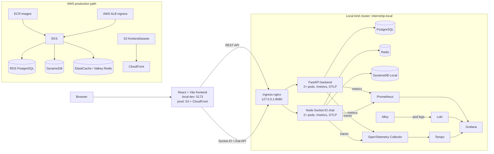

# Internship Application Platform

Full-stack internship application platform with candidate/HR workflows, document upload, CV-job matching, realtime chat, local Kubernetes, and an EKS deployment path.

The current architecture is centered on Kubernetes:

- Local demo/dev: `kind` cluster named `internship-local`.
- Local app dependencies: PostgreSQL, Redis, and DynamoDB Local in Kubernetes.
- Backend: FastAPI + SQLAlchemy + Alembic.
- Chat: Node.js + Express + Socket.IO + Redis adapter + DynamoDB tables.
- Frontend: React + Vite, run locally in dev and deployed to S3/CloudFront in production.
- Observability: Prometheus, Grafana, Loki, Alloy, OpenTelemetry Collector, and Tempo.
- Production path: EKS + ALB + ECR + RDS PostgreSQL + DynamoDB + ElastiCache/Valkey + S3 + CloudFront + GitHub Actions OIDC.

## Quick Links

- Kubernetes runbook: [k8s/RUNBOOK.md](k8s/RUNBOOK.md)
- Local Kubernetes script for Windows: [scripts/k8s/deploy-local.ps1](scripts/k8s/deploy-local.ps1)
- Local Kubernetes script for macOS/Linux: [scripts/k8s/deploy-local.sh](scripts/k8s/deploy-local.sh)
- EKS deploy script: [scripts/k8s/deploy-eks.sh](scripts/k8s/deploy-eks.sh)
- GitHub Actions workflows: [.github/workflows](.github/workflows)

## Architecture


```mermaid
flowchart LR
    Browser["Browser"]
    Frontend["React + Vite frontend\nlocal dev: 5173\nprod: S3 + CloudFront"]

    subgraph LocalKind["Local kind cluster: internship-local"]
        Nginx["ingress-nginx\n127.0.0.1:8080"]
        Backend["FastAPI backend\n2+ pods, /metrics, OTLP"]
        Chat["Node Socket.IO chat\n2+ pods, /metrics, OTLP"]
        Postgres[("PostgreSQL")]
        Redis[("Redis")]
        DynamoLocal[("DynamoDB Local")]

        Prom["Prometheus"]
        Grafana["Grafana"]
        Loki["Loki"]
        Alloy["Alloy"]
        OTel["OpenTelemetry Collector"]
        Tempo["Tempo"]
    end

    Browser --> Frontend
    Frontend -->|"REST API"| Nginx
    Frontend -->|"Socket.IO / chat API"| Nginx
    Nginx --> Backend
    Nginx --> Chat
    Backend --> Postgres
    Chat --> Redis
    Chat --> DynamoLocal

    Backend -->|"metrics"| Prom
    Chat -->|"metrics"| Prom
    Backend -->|"traces"| OTel
    Chat -->|"traces"| OTel
    OTel --> Tempo
    Alloy -->|"pod logs"| Loki
    Prom --> Grafana
    Loki --> Grafana
    Tempo --> Grafana

    subgraph AWS["AWS production path"]
        ALB["AWS ALB ingress"]
        EKS["EKS"]
        ECR["ECR images"]
        RDS[("RDS PostgreSQL")]
        DDB[("DynamoDB")]
        Valkey[("ElastiCache / Valkey Redis")]
        S3["S3 frontend/assets"]
        CF["CloudFront"]
    end

    ECR --> EKS
    ALB --> EKS
    EKS --> RDS
    EKS --> DDB
    EKS --> Valkey
    S3 --> CF
```

## Main Features

- JWT authentication with candidate and HR roles.
- Candidate dashboard, profile, job browsing, applications, documents, and status timeline.
- HR company profile, job posting, applicant review, document download, and status updates.
- Document upload with local storage in development and S3-compatible storage in production.
- Local CV-job matching using skill extraction and TF-IDF cosine similarity.
- Realtime chat with Socket.IO, Redis scaling adapter, and DynamoDB-backed chat data.
- Kubernetes health probes, Alembic migration Job, chat table initialization Job, HPA, PDB, ingress, and sticky chat sessions.
- Metrics, logs, and traces through Prometheus, Loki, Alloy, OpenTelemetry, Tempo, and Grafana.
- CI and deployment workflows for tests, image build/push, EKS rollout, frontend S3 upload, and CloudFront invalidation.

## Repository Layout

```text
backend/                 FastAPI app, Alembic migrations, tests
chat-service/            Node.js chat service, Socket.IO, DynamoDB, Redis
frontend/                React + Vite frontend
k8s/app/                 App namespaces, config, deps, jobs, deployments, ingress, HPA, PDB
k8s/platform/            ingress-nginx and metrics-server Helm values
k8s/observability/       Prometheus, Grafana, Loki, Alloy, Tempo, OTel manifests/values
k8s/eks/                 EKS config, ALB ingress, service account, secret template
scripts/k8s/             Local and EKS deployment scripts
observability/           Docker Compose observability reference configs
.github/workflows/       CI, EKS deploy, frontend deploy
docker-compose.yml       Optional Compose stack for local non-k8s development
```

## Local Kubernetes Quick Start

Prerequisites:

- Docker Desktop or Docker Engine
- kubectl
- kind
- Helm

Windows PowerShell:

```powershell
Set-ExecutionPolicy -Scope Process Bypass -Force
.\scripts\k8s\deploy-local.ps1 -RecreateCluster
```

macOS/Linux:

```bash
chmod +x scripts/k8s/deploy-local.sh
./scripts/k8s/deploy-local.sh --recreate-cluster
```

The local cluster exposes:

```text
Backend API: http://api.internship.localhost:8080
Chat API:    http://chat.internship.localhost:8080
```

Health checks:

Windows:

```powershell
Invoke-RestMethod http://api.internship.localhost:8080/health/ready
Invoke-RestMethod http://chat.internship.localhost:8080/health/ready
```

macOS/Linux:

```bash
curl --noproxy '*' http://api.internship.localhost:8080/health/ready
curl --noproxy '*' http://chat.internship.localhost:8080/health/ready
```

Expected responses:

```json
{"status":"ready","service":"internship-api","dependencies":{"postgres":true}}
{"status":"ready","dependencies":{"redis":true,"dynamodb":true}}
```

## Open The Current Web App

The frontend is not deployed into local `kind`. Run it as a local Vite dev server and point it to the Kubernetes ingress.

Windows PowerShell:

```powershell
Push-Location frontend
npm install
$env:VITE_API_BASE_URL = "http://api.internship.localhost:8080"
$env:VITE_CHAT_API_BASE_URL = "http://chat.internship.localhost:8080"
npm run dev -- --host 127.0.0.1
```

macOS/Linux:

```bash
cd frontend
npm install
VITE_API_BASE_URL=http://api.internship.localhost:8080 \
VITE_CHAT_API_BASE_URL=http://chat.internship.localhost:8080 \
npm run dev -- --host 127.0.0.1
```

Open:

```text
http://127.0.0.1:5173
```

Keep the Vite terminal open while using the site.

Alternative: run only the frontend with Docker Compose while backend/chat stay in kind:

Windows:

```powershell
$env:VITE_API_BASE_URL = "http://api.internship.localhost:8080"
$env:VITE_CHAT_API_BASE_URL = "http://chat.internship.localhost:8080"
docker compose up -d --build --no-deps frontend
docker compose logs -f frontend
```

macOS/Linux:

```bash
VITE_API_BASE_URL=http://api.internship.localhost:8080 \
VITE_CHAT_API_BASE_URL=http://chat.internship.localhost:8080 \
docker compose up -d --build --no-deps frontend
docker compose logs -f frontend
```

Then open `http://127.0.0.1:5173`.

If port `5173` is busy:

Windows:

```powershell
Get-NetTCPConnection -LocalPort 5173 -State Listen -ErrorAction SilentlyContinue |
  Select-Object LocalAddress,LocalPort,OwningProcess
```

macOS/Linux:

```bash
lsof -nP -iTCP:5173 -sTCP:LISTEN
```

## Check What Is Running

Use `kubectl` for pods. Docker Desktop usually shows only the `kind` node containers, not every Kubernetes pod.

```bash
kubectl config current-context
kubectl get nodes -o wide
kubectl get pods -n internship
kubectl get pods -n monitoring
kubectl get pods -A
```

App overview:

```bash
kubectl get pods,svc,ingress,hpa,pdb -n internship
kubectl wait --for=condition=complete job/backend-migrate job/chat-init -n internship --timeout=30s
```

If you use Docker Desktop, the containers you should expect to see are the kind nodes:

```text
internship-local-control-plane
internship-local-worker
internship-local-worker2
```

For a terminal UI:

Windows:

```powershell
winget install derailed.k9s
k9s --context kind-internship-local -n internship
```

macOS:

```bash
brew install k9s
k9s --context kind-internship-local -n internship
```

## Check Logs

Backend logs:

```bash
kubectl logs deployment/backend -n internship --tail=100
kubectl logs deployment/backend -n internship -f --tail=100
```

Chat logs:

```bash
kubectl logs deployment/chat-service -n internship --tail=100
kubectl logs deployment/chat-service -n internship -f --tail=100
```

Migration/init job logs:

```bash
kubectl logs job/backend-migrate -n internship
kubectl logs job/chat-init -n internship
```

Local dependency logs:

```bash
kubectl logs deployment/postgres -n internship --tail=100
kubectl logs deployment/redis -n internship --tail=100
kubectl logs deployment/dynamodb-local -n internship --tail=100
```

Ingress logs:

```bash
kubectl logs -n ingress-nginx -l app.kubernetes.io/component=controller -f --tail=100
```

Observability logs:

```bash
kubectl logs deployment/otel-collector -n monitoring --tail=100
kubectl logs statefulset/loki -n monitoring --tail=100
kubectl logs statefulset/tempo -n monitoring --tail=100
```

Describe a pod when it is not ready:

```bash
kubectl describe pod <pod-name> -n internship
```

## Open Observability

Grafana is exposed locally on port `3001`. Prometheus is exposed locally on port
`9092`. Keep each `kubectl port-forward` command running in its own terminal
while you use the URL from another terminal or browser.

Check that the monitoring services are running:

```bash
kubectl get pods,svc -n monitoring
```

### Grafana

Windows PowerShell:

```powershell
kubectl port-forward service/kube-prometheus-stack-grafana 3001:80 -n monitoring
```

macOS or Linux:

```bash
kubectl port-forward service/kube-prometheus-stack-grafana 3001:80 -n monitoring
```

Open:

```text
http://127.0.0.1:3001
```

Local login:

```text
admin / admin123
```

### Prometheus

Windows PowerShell:

```powershell
kubectl port-forward service/kube-prometheus-stack-prometheus 9092:9090 -n monitoring
```

macOS or Linux:

```bash
kubectl port-forward service/kube-prometheus-stack-prometheus 9092:9090 -n monitoring
```

Open:

```text
http://127.0.0.1:9092/targets
```

Expected app targets:

- `backend` is `up`
- `chat-service` is `up`

If the browser shows `ERR_CONNECTION_REFUSED`, the local port-forward is not
accepting connections. Leave the port-forward terminal open, confirm the service
exists, and check whether the local port is already in use.

Windows PowerShell:

```powershell
kubectl get pods,svc -n monitoring
Get-NetTCPConnection -LocalPort 3001,9092 -ErrorAction SilentlyContinue
```

macOS or Linux:

```bash
kubectl get pods,svc -n monitoring
lsof -nP -iTCP:3001 -sTCP:LISTEN
lsof -nP -iTCP:9092 -sTCP:LISTEN
```

Loki query through port-forward:

```bash
kubectl port-forward service/loki-gateway 3101:80 -n monitoring
```

Then:

```bash
curl --noproxy '*' -G "http://127.0.0.1:3101/loki/api/v1/query_range" --data-urlencode 'query={namespace="internship"}' --data-urlencode 'limit=5'
```

Tempo trace smoke test:

```bash
curl --noproxy '*' http://api.internship.localhost:8080/openapi.json >/dev/null
curl --noproxy '*' http://chat.internship.localhost:8080/api/status >/dev/null
kubectl port-forward service/tempo 3201:3200 -n monitoring
curl --noproxy '*' http://127.0.0.1:3201/metrics | grep tempo_distributor_spans_received_total
```

## Daily Development Loop

After backend or chat-service changes:

Windows:

```powershell
.\scripts\k8s\deploy-local.ps1 -SkipCluster -SkipObservability
```

macOS/Linux:

```bash
./scripts/k8s/deploy-local.sh --skip-cluster --skip-observability
```

If pods still run old behavior, rebuild, load images into kind, and restart:

```bash
docker build -t internship-api:local ./backend
docker build -t internship-chat:local ./chat-service
kind load docker-image internship-api:local --name internship-local
kind load docker-image internship-chat:local --name internship-local
kubectl rollout restart deployment/backend deployment/chat-service -n internship
```

After frontend changes:

```bash
cd frontend
npm run build
npm run dev -- --host 127.0.0.1
```

## Optional Docker Compose Mode

Docker Compose is still useful for simpler local development without Kubernetes.

Copy the env file:

Windows:

```powershell
Copy-Item .env.example .env
```

macOS/Linux:

```bash
cp .env.example .env
```

Start the core Compose app:

```bash
docker compose up -d --build db redis dynamodb-local backend chat-service frontend
```

Open:

```text
Frontend: http://127.0.0.1:5173
Backend:  http://127.0.0.1:8001
Chat:     http://127.0.0.1:3000
```

Compose logs:

```bash
docker compose logs -f backend
docker compose logs -f chat-service
docker compose logs -f frontend
```

Do not run the Compose observability stack at the same time as kind ingress unless you move `CADVISOR_PORT`, because cAdvisor also uses `8080`.

## Testing And Validation

Backend syntax/import smoke check:

```bash
python -m py_compile backend/app/main.py backend/app/core/tracing.py
```

Chat syntax check:

```bash
cd chat-service
npm run check
```

Frontend build:

```bash
cd frontend
npm run build
```

Shell script syntax:

```bash
docker run --rm -v "${PWD}:/repo" -w /repo bash:5.2 bash -n scripts/k8s/deploy-local.sh scripts/k8s/deploy-eks.sh
```

Whitespace check:

```bash
git diff --check
```

## Production/EKS Path

The EKS path uses AWS managed services:

- EKS for backend/chat workloads
- AWS Load Balancer Controller with ALB ingress
- ECR for backend/chat images
- RDS PostgreSQL for backend data
- DynamoDB for chat tables
- ElastiCache/Valkey Redis for Socket.IO scaling
- S3 + CloudFront for frontend static hosting
- GitHub Actions OIDC for deployment

Required GitHub Environment secrets:

- `AWS_ROLE_TO_ASSUME`
- `SECRET_KEY`
- `DATABASE_URL`
- `REDIS_URL`
- `S3_BUCKET` when uploads use S3

Required GitHub Environment variables:

- `AWS_REGION`
- `EKS_CLUSTER_NAME`
- `ECR_REPOSITORY_BACKEND`
- `ECR_REPOSITORY_CHAT`
- `FRONTEND_ORIGIN`
- `API_HOST`
- `CHAT_HOST`
- `IRSA_ROLE_ARN`
- `VITE_API_BASE_URL`
- `VITE_CHAT_API_BASE_URL`
- `FRONTEND_BUCKET`
- `CLOUDFRONT_DISTRIBUTION_ID`

Workflows:

- `.github/workflows/ci.yml`
- `.github/workflows/deploy-eks.yml`
- `.github/workflows/deploy-frontend.yml`

The backend/chat workflow builds SHA-tagged ECR images, applies Kubernetes manifests, runs Alembic and chat init Jobs, rolls out deployments, and can smoke-test public health URLs.

The frontend workflow builds Vite with production API/chat URLs, uploads `frontend/dist` to S3, and invalidates CloudFront.

## Useful Health URLs

Local Kubernetes:

```text
http://api.internship.localhost:8080/health/live
http://api.internship.localhost:8080/health/ready
http://chat.internship.localhost:8080/health/live
http://chat.internship.localhost:8080/health/ready
```

Port-forward fallback:

```text
http://127.0.0.1:8001/health/ready
http://127.0.0.1:3002/health/ready
```

Compose mode:

```text
http://127.0.0.1:8001/health/ready
http://127.0.0.1:3000/health/ready
```

## Troubleshooting Shortcuts

Current context:

```bash
kubectl config current-context
kubectl config get-contexts
kubectl config use-context kind-internship-local
```

Port ownership:

Windows:

```powershell
Get-NetTCPConnection -LocalPort 5173,8001,8080,8443,3000,3002 -State Listen -ErrorAction SilentlyContinue |
  Select-Object LocalAddress,LocalPort,OwningProcess
```

macOS/Linux:

```bash
lsof -nP -iTCP:5173 -sTCP:LISTEN
lsof -nP -iTCP:8001 -sTCP:LISTEN
lsof -nP -iTCP:8080 -sTCP:LISTEN
lsof -nP -iTCP:8443 -sTCP:LISTEN
```

Ingress details:

```bash
docker ps --filter name=internship-local-control-plane
kubectl get svc -n ingress-nginx ingress-nginx-controller -o wide
kubectl describe ingress backend chat-service -n internship
```

Expected kind port mapping:

```text
127.0.0.1:8080->30080/tcp
127.0.0.1:8443->30443/tcp
```

HPA metrics:

```bash
kubectl get apiservice v1beta1.metrics.k8s.io
kubectl top pods -n internship
kubectl get hpa -n internship
```

Reset local kind:

Windows:

```powershell
kind delete cluster --name internship-local
.\scripts\k8s\deploy-local.ps1 -RecreateCluster
```

macOS/Linux:

```bash
kind delete cluster --name internship-local
./scripts/k8s/deploy-local.sh --recreate-cluster
```
